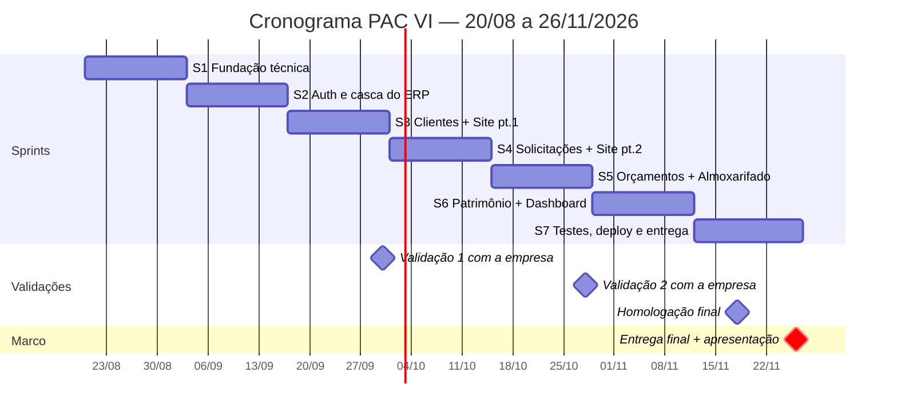

# Cronograma PAC VI — Sistema Web para Gerenciamento de Metalúrgica

**Projeto:** Site institucional + ERP para a Metalúrgica Mayer (Massaranduba/SC)
**Disciplina:** PAC Extensionista — Engenharia de Software — Católica de Santa Catarina
**Período:** 20/08/2026 a 26/11/2026 (99 dias — 7 sprints de 2 semanas)
**Marco fixo:** entrega final e apresentação em **26/11/2026**

---

## 1. Contexto e escopo

A etapa anterior do PAC entregou toda a especificação da solução (requisitos, casos de uso,
modelagem de dados, arquitetura, plano de testes, wireframes e protótipos desktop/mobile),
mas **não chegou à codificação** — ponto apontado na própria autoavaliação do relatório final.

O PAC VI é, portanto, a **fase de implementação**: transformar a documentação existente em um
sistema funcional, cobrindo os dois módulos previstos.

**Stack definida:** Python + Flask (API REST) · PostgreSQL · HTML5 + Tailwind CSS + JavaScript · Git/GitHub
**Arquitetura:** cliente-servidor em camadas (navegador → frontend → API REST → banco)
**Repositório:** `frontend/` (site + ERP) · `backend/` (API, rotas, controllers, models) · `docs/` (documentação)

### Escopo do semestre (implementação integral)

| Módulo | Itens |
|---|---|
| Site institucional | Página inicial, Sobre nós, Serviços e portfólio, Solicitação de serviços, Contato |
| ERP — acesso | Login/autenticação, controle de acesso por perfil, gestão de perfil |
| ERP — operação | Dashboard, Clientes, Solicitações, Orçamentos, Almoxarifado, Patrimônio |
| Transversal | Layout padrão (menu lateral + barra superior), responsividade desktop/mobile, testes, deploy |

---

## 2. Premissas

1. Os requisitos, casos de uso, modelo de dados e protótipos da etapa anterior são o **insumo de entrada** e são considerados válidos; ajustes pontuais entram como tarefa de sprint, não como novo levantamento.
2. Sprints de 14 dias corridos, iniciando na **quinta-feira** e encerrando na **quarta-feira** (a última tem 15 dias para fechar exatamente em 26/11).
3. Equipe de 5 integrantes trabalhando em paralelo em frentes distintas (backend, frontend, dados, QA/documentação, contato com a empresa) — a divisão nominal fica a critério da equipe.
4. Toda sprint termina com código integrado na branch principal e funcionando de ponta a ponta; nada fica "pronto na máquina de alguém".
5. Validação com a Metalúrgica Mayer em pelo menos **três momentos** (Sprints 3, 5 e 7).

---

## 3. Visão geral das sprints

| Sprint | Período | Tema | Entregável principal |
|:---:|---|---|---|
| **1** | 20/08 – 02/09 | Fundação técnica | Ambiente, banco e esqueleto da aplicação rodando |
| **2** | 03/09 – 16/09 | Autenticação e casca do ERP | Login funcional + layout base + gestão de perfil |
| **3** | 17/09 – 30/09 | Clientes + site (parte 1) | CRUD de clientes + Home e Sobre nós publicados |
| **4** | 01/10 – 14/10 | Solicitações + site (parte 2) | CRUD de solicitações + Serviços, Contato e formulário integrado |
| **5** | 15/10 – 28/10 | Orçamentos + Almoxarifado | Orçamentos vinculados a solicitações + controle de estoque |
| **6** | 29/10 – 11/11 | Patrimônio + Dashboard | Módulo de patrimônio + indicadores + responsividade mobile |
| **7** | 12/11 – 26/11 | Testes, deploy e entrega | Sistema em produção + relatório final + apresentação |

---

## 4. Cadência e ritos

| Rito | Quando | Duração | Objetivo |
|---|---|---|---|
| Planning | 1º dia da sprint (quinta) | 1h | Selecionar itens do backlog e quebrar em tarefas |
| Acompanhamento | 2x por semana (assíncrono no grupo) | 15 min | O que fiz / o que farei / o que está travando |
| Review | Último dia da sprint (quarta) | 1h | Demonstrar o incremento funcionando |
| Retrospectiva | Junto com a review | 30 min | O que manter, o que ajustar na próxima sprint |
| Validação com a empresa | Sprints 3, 5 e 7 | 1h | Confirmar aderência à rotina real da metalúrgica |

### Definition of Ready (para entrar na sprint)
- Requisito rastreado até o documento de requisitos da etapa anterior
- Protótipo de tela correspondente identificado (Apêndice A do relatório)
- Critério de aceite escrito
- Dependências de banco/API resolvidas ou planejadas na mesma sprint

### Definition of Done (para sair da sprint)
- Endpoint da API implementado, validado e com tratamento de erro
- Tela conectada à API, responsiva em desktop e mobile
- Caso de teste executado e registrado na matriz de rastreabilidade
- Código revisado por outro integrante (pull request aprovado) e integrado na branch principal
- Documentação do módulo atualizada em `docs/`

---

## 5. Detalhamento das sprints

### Sprint 1 — Fundação técnica
**20/08 a 02/09** · *Objetivo: sair do papel — ambiente, banco e aplicação mínima rodando para todos.*

**Backend / Infra**
- Estruturar o repositório conforme o previsto (`frontend/`, `backend/`, `docs/`)
- Criar o projeto Flask com blueprints, configuração por ambiente e `requirements.txt`
- Subir PostgreSQL local (script ou Docker Compose) e configurar a conexão/ORM
- Implementar as migrations do modelo de dados especificado (clientes, solicitações, orçamentos, materiais, movimentações, patrimônio, usuários)
- Endpoint de health check e um CRUD-piloto para validar a stack de ponta a ponta

**Frontend**
- Configurar Tailwind CSS e o padrão de build/assets
- Criar o layout base reaproveitável: menu lateral, barra superior, componentes comuns
- Definir a paleta, tipografia e espaçamentos a partir dos protótipos

**Processo**
- Padronizar fluxo Git: branches por feature, pull request com revisão, convenção de commits
- Criar o quadro de backlog (GitHub Projects) com todos os requisitos da etapa anterior
- Revalidar requisitos e protótipos, registrando divergências encontradas

**Critérios de saída:** todos os integrantes conseguem rodar a aplicação e o banco localmente; o CRUD-piloto grava e lê do PostgreSQL; backlog completo no quadro.

> ⚠️ Feriado no período: 07/09 (segunda) cai na Sprint 2 — considerar na capacidade.

---

### Sprint 2 — Autenticação e casca do ERP
**03/09 a 16/09** · *Objetivo: entrar no sistema e navegar pela estrutura completa.*

**Backend**
- Cadastro de usuários com senha criptografada (hash)
- Login/logout, gerenciamento de sessão e proteção das rotas administrativas
- Controle de acesso por perfil de usuário
- Endpoints de gestão de perfil: consultar dados, alterar nome/dados pessoais, trocar senha

**Frontend**
- Tela de login do ERP (Figura 6 do relatório)
- Shell do ERP: navegação lateral com todos os módulos, barra superior, estados de sessão
- Tela de gestão de perfil (Figura 12)
- Tratamento de erros e mensagens de feedback padronizados

**QA / Docs**
- Casos de teste de autenticação e de controle de acesso
- Documentar o fluxo de autenticação em `docs/`

**Critérios de saída:** usuário autenticado acessa o ERP, navega por todos os módulos (ainda vazios) e altera sua própria senha; rota administrativa sem sessão é bloqueada.

---

### Sprint 3 — Clientes + Site institucional (parte 1)
**17/09 a 30/09** · *Objetivo: primeiro módulo de negócio completo e presença online no ar.*

**ERP — Gestão de clientes**
- CRUD completo: incluir, editar, excluir e pesquisar (nome, telefone, e-mail, endereço, observações)
- Listagem com busca e paginação
- Validações de campos obrigatórios e formatos
- Estrutura para o histórico de solicitações do cliente (preenchida na Sprint 4)

**Site institucional**
- Página inicial: apresentação da empresa e área de atuação (Figura 1)
- Página "Sobre nós" (Figura 2)
- Responsividade e ajustes de conteúdo com material fornecido pela empresa

**QA / Validação**
- Casos de teste do módulo de clientes executados e registrados
- **Validação 1 com a Metalúrgica Mayer (até 30/09):** apresentar login, navegação, clientes e as páginas públicas

**Critérios de saída:** cadastro de clientes usável em condições reais; duas páginas do site publicadas e responsivas; feedback da empresa registrado como itens de backlog.

> ⚠️ Feriado no período seguinte: 12/10 (segunda) cai na Sprint 4.

---

### Sprint 4 — Solicitações + Site institucional (parte 2)
**01/10 a 14/10** · *Objetivo: fechar o ciclo cliente → solicitação, incluindo a entrada pelo site.*

**ERP — Gestão de solicitações**
- Cadastrar, consultar e editar solicitações, sempre vinculadas a um cliente
- Atualização e acompanhamento de status do serviço
- Filtros por cliente, status e período
- Histórico de solicitações exibido na ficha do cliente

**Site institucional**
- Página de serviços e portfólio de projetos realizados (Figura 3)
- Página de solicitação de serviços com formulário (Figura 4)
- Página de contato (Figura 5)
- **Integração:** formulário público grava uma solicitação no ERP e cria/vincula o cliente

**QA / Docs**
- Casos de teste de solicitações e do fluxo público → interno
- Atualizar matriz de rastreabilidade

**Critérios de saída:** solicitação enviada pelo site aparece no ERP vinculada ao cliente correto; site institucional completo no ar.

---

### Sprint 5 — Orçamentos + Almoxarifado
**15/10 a 28/10** · *Objetivo: cobrir a parte comercial e o controle de materiais.*

**ERP — Gestão de orçamentos**
- Criar e editar orçamentos vinculados à solicitação correspondente
- Itens do orçamento com quantidades e valores, com cálculo do total
- Situação do orçamento (pendente, aprovado, recusado) e campo de observações
- Listagem com filtros e acompanhamento

**ERP — Almoxarifado**
- Cadastro de materiais (Figura 11)
- Registro de entradas e saídas de estoque
- Saldo disponível calculado e consulta das movimentações
- Alerta de saldo baixo (se houver folga na sprint)

**QA / Validação**
- Casos de teste de orçamentos e movimentações de estoque
- **Validação 2 com a Metalúrgica Mayer (até 28/10):** demonstrar solicitações, orçamentos e almoxarifado com dados reais da empresa

**Critérios de saída:** é possível percorrer solicitação → orçamento → aprovação; entradas e saídas refletem corretamente no saldo de materiais.

> ⚠️ Feriado no período seguinte: 02/11 (segunda) cai na Sprint 6.

---

### Sprint 6 — Patrimônio + Dashboard + responsividade
**29/10 a 11/11** · *Objetivo: fechar o escopo funcional e polir a experiência de uso.*

**ERP — Patrimônio**
- Cadastro e consulta de bens
- Estado de conservação, localização e situação (ativo, em manutenção, inativo)
- Atualização de informações e filtros de consulta

**ERP — Dashboard**
- Indicadores: clientes cadastrados, solicitações em andamento, orçamentos pendentes, materiais cadastrados, patrimônio registrado (Figura 7)
- Atalhos para os principais módulos

**Transversal**
- Revisão de responsividade mobile em todas as telas (site e ERP)
- Padronização visual entre módulos, estados de carregamento e mensagens de erro
- Ajustes acumulados do feedback das validações 1 e 2

**Critérios de saída:** todos os módulos previstos implementados; dashboard com números reais vindos do banco; navegação consistente em desktop e celular.

---

### Sprint 7 — Testes, deploy e entrega final
**12/11 a 26/11** (15 dias) · *Objetivo: sistema estável em produção e material acadêmico entregue.*

**Semana 1 (12/11 – 18/11) — Qualidade e publicação**
- Execução completa do plano de testes com todos os casos de teste da etapa anterior
- Fechamento da matriz de rastreabilidade requisito → caso de teste → resultado
- Correção dos defeitos encontrados, por ordem de severidade
- Deploy da aplicação e do banco em ambiente acessível pela empresa
- Carga de dados iniciais reais (clientes, materiais, patrimônio)
- **Homologação final com a Metalúrgica Mayer (até 18/11)**

**Semana 2 (19/11 – 26/11) — Fechamento acadêmico**
- Ajustes finais decorrentes da homologação
- Manual de uso do sistema para a empresa
- Documentação técnica final em `docs/`: arquitetura implementada, modelo de dados final, instruções de instalação e execução
- Relatório final do PAC VI, incluindo a avaliação do público beneficiado e a autoavaliação da equipe
- Atualização da apresentação: substituir os placeholders `[Inserir captura de tela]` pelas telas reais do sistema
- Ensaio da apresentação
- **📌 26/11 — Entrega final e apresentação**

> ⚠️ Feriados no período: 15/11 (domingo) e 20/11 (sexta, Consciência Negra) — a semana de 16 a 20/11 tem capacidade reduzida.

---

## 6. Escopo secundário (só com folga confirmada)

Itens desejáveis que **não** comprometem a entrega se ficarem de fora. Só puxar quando a sprint corrente estiver com o escopo obrigatório concluído:

- Upload de foto de perfil do usuário
- Exportação de orçamentos em PDF
- Alerta automático de estoque mínimo no almoxarifado
- Relatórios gerenciais simples (por período, por cliente)

**Fora do escopo deste semestre** (registrado no slide "Evoluções Futuras"): gestão de boletos e transações financeiras, integração com WhatsApp, envio automático de e-mails, dashboard analítico de mercado e aplicativo mobile.

---

## 7. Riscos e contingências

| Risco | Impacto | Contingência |
|---|---|---|
| Escopo integral em 7 sprints com equipe acadêmica | Alto | Ordem das sprints é a ordem de prioridade: Patrimônio e Dashboard (S6) são os primeiros a serem reduzidos se houver atraso. Almoxarifado tem versão mínima (cadastro + entrada/saída) já prevista |
| Curva de aprendizado da stack (Flask, PostgreSQL, Tailwind) | Alto | Sprint 1 inteira dedicada à fundação, com CRUD-piloto antes de qualquer módulo real |
| Indisponibilidade da empresa para validar | Médio | Validações agendadas com antecedência nas Sprints 3, 5 e 7; se falhar, seguir com o protótipo aprovado como referência |
| Feriados e provas concentrados em out/nov | Médio | Feriados sinalizados sprint a sprint; escopo secundário serve de amortecedor |
| Integração frontend ↔ API deixada para o fim | Alto | DoD exige tela conectada à API na mesma sprint — nada de "tela pronta, falta ligar" |
| Trabalho não integrado até a véspera | Alto | Branch principal sempre executável; pull request revisado por outro integrante |

---

## 8. Checklist da entrega final (26/11)

- [ ] Site institucional completo e publicado (5 páginas)
- [ ] ERP completo: login, perfil, dashboard, clientes, solicitações, orçamentos, almoxarifado, patrimônio
- [ ] Aplicação responsiva em desktop e mobile
- [ ] Sistema publicado em ambiente acessível à empresa, com dados iniciais carregados
- [ ] Plano de testes executado e matriz de rastreabilidade fechada
- [ ] Repositório organizado (`frontend/`, `backend/`, `docs/`) com README de instalação e execução
- [ ] Manual de uso entregue à Metalúrgica Mayer
- [ ] Avaliação do público beneficiado registrada (homologação da Sprint 7)
- [ ] Relatório final do PAC VI concluído
- [ ] Apresentação atualizada com capturas reais do sistema e ensaiada
